# B机体合成图

## 0高达

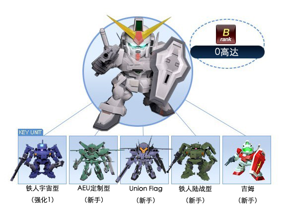

------------

## BD2

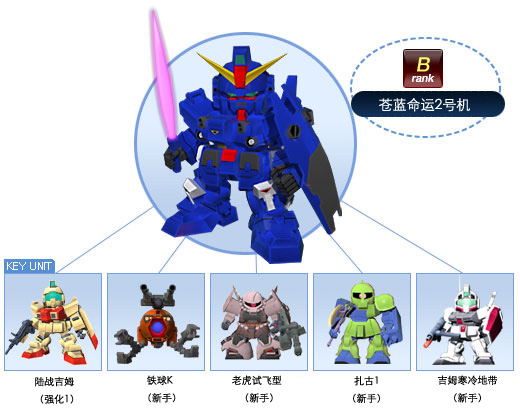

------------

## E魔蟹

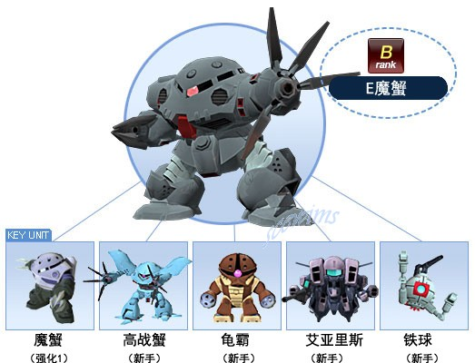

------------

## GN-X（达利尔·达奇专用机）

.jpg ":size=500x")

------------

## GP-01玉兰

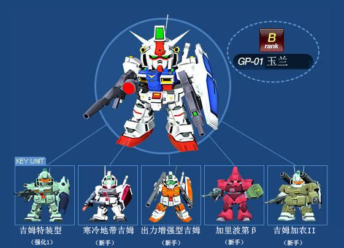

------------

## MKII（幽谷式样）

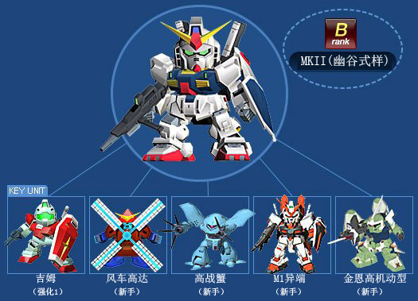

------------

## R-贾贾

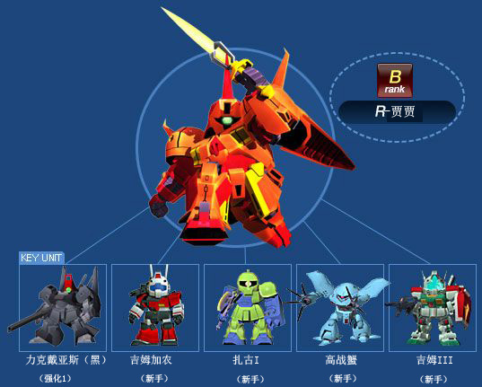

------------

## 京宝樊

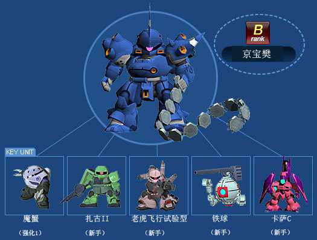

------------

## 伊芙利特改

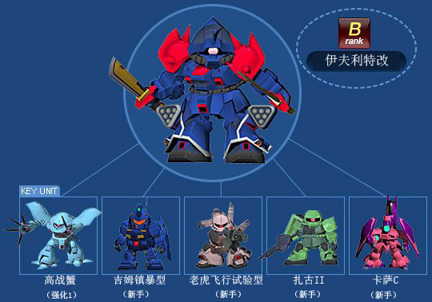

------------

## 勇士

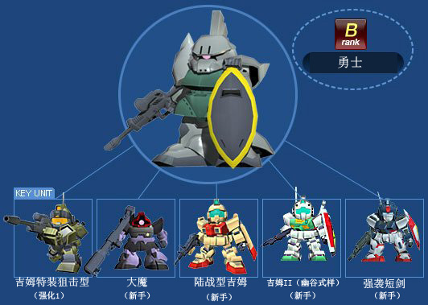

------------

## 希古

------------

## 异端金色机天（未完成）

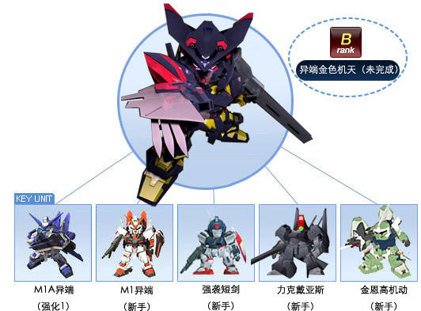

------------

## 扎古2指挥官专用

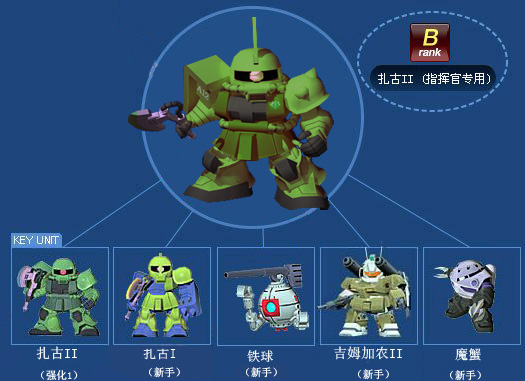

------------

## 扎古III

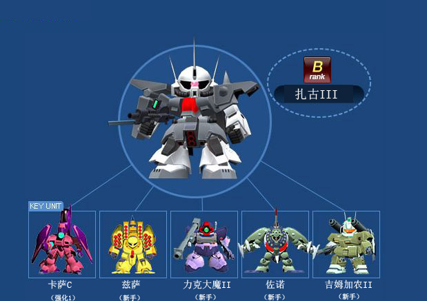

------------

## 杜鲁基斯

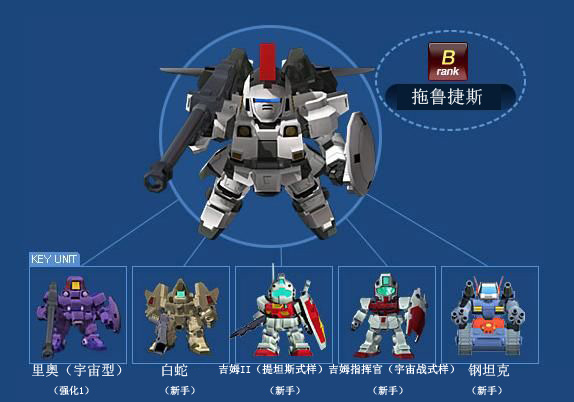

------------

## 改良型勇士

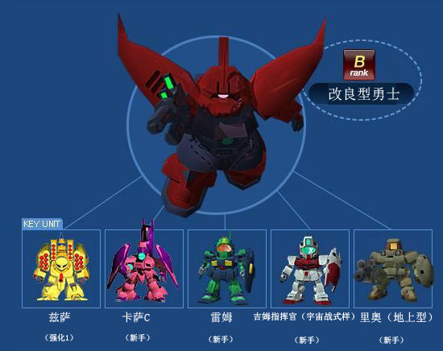

------------

## 日升高达

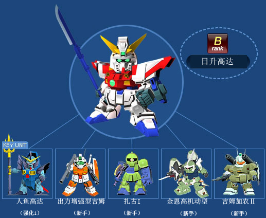

------------

## Flag（格拉汉姆专用）

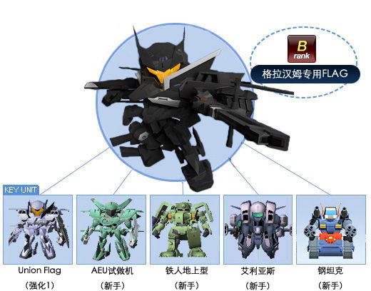

------------

## 梅萨拉

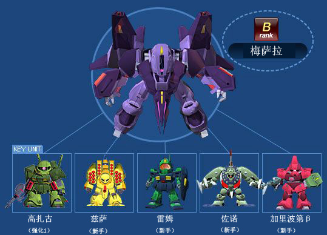

------------

## 汉姆扎比

------------

## 沙漠高达

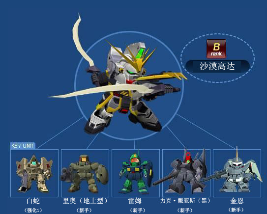

------------

## 玻利诺克·萨曼

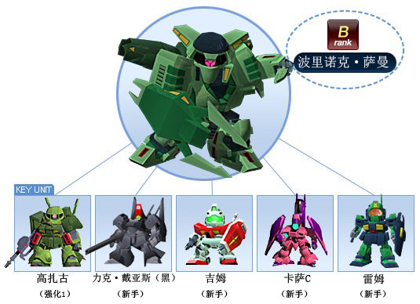

------------

## 勇士（海军陆战队专用）

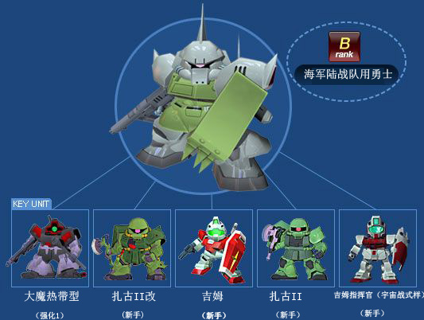

------------

## 火虎

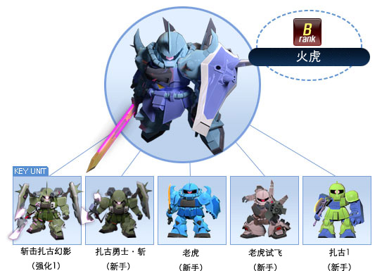

------------

## 炮击型勇士

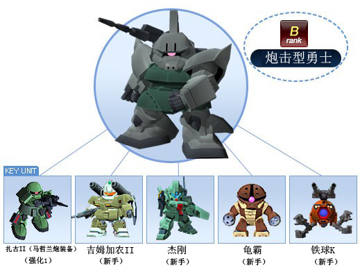

------------

## 狙击型勇士

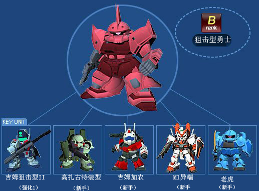

------------

## 盖茨

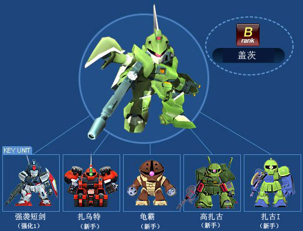

------------

## 盖茨（指挥官专用）

------------

## 神龙高达

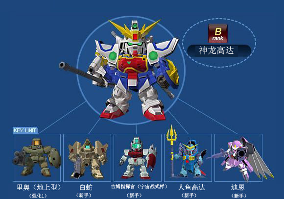

------------

## 红异端

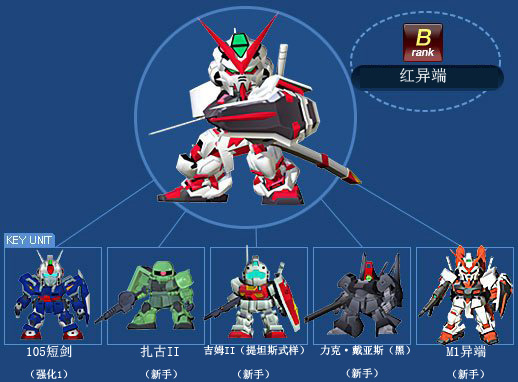

------------

## 老虎特装型

------------

## 绿异端

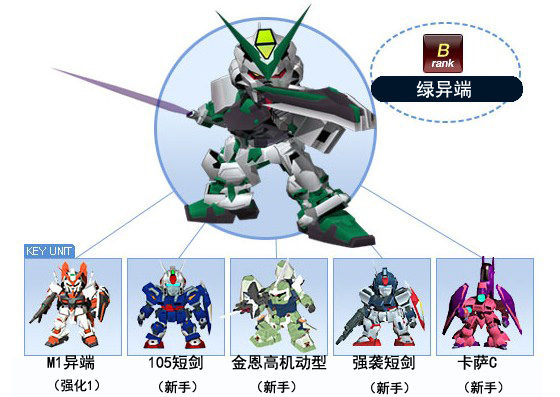

------------

## 红色角马

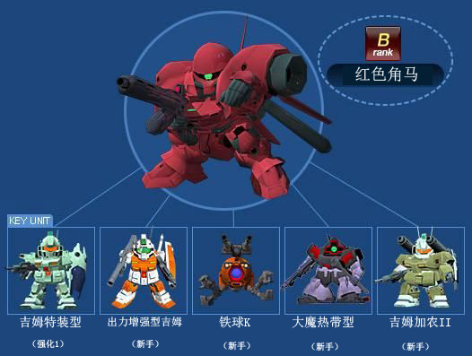

------------

## 苍蓝宿命1号机

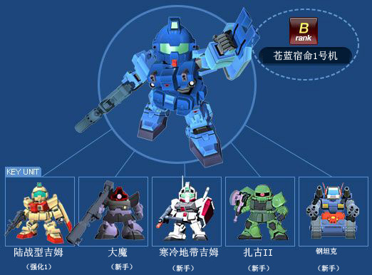

------------

## 萨梅尔

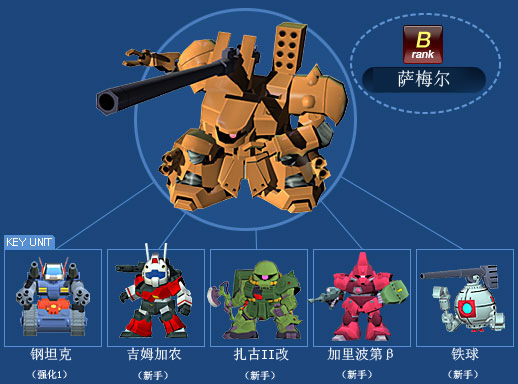

------------

## 葛士尼

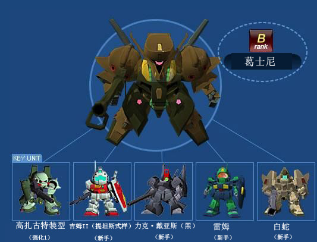

------------

## 蓝异端

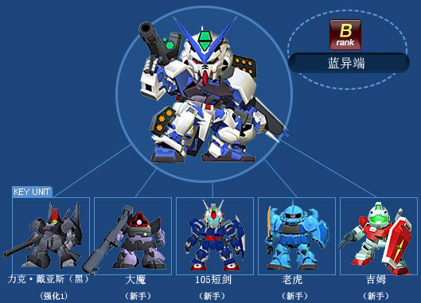

------------

## 诺贝尔高达

------------

## 达基伊利斯

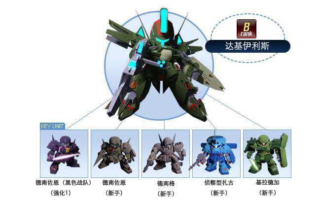

------------

## 迪杰

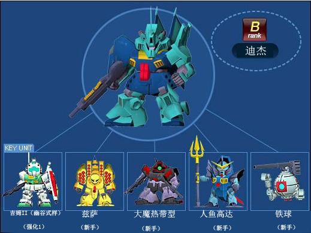

------------

## 里歇尔

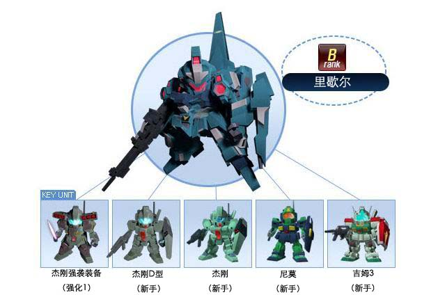

------------

## 量产形卡碧尼

------------

## 金异端

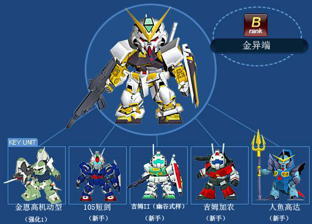

------------

## 铁人（高机动形）

------------

## 阿历克斯

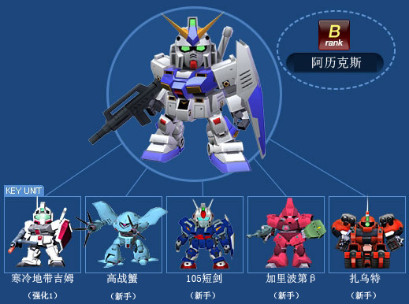

------------

## 陆战型高达

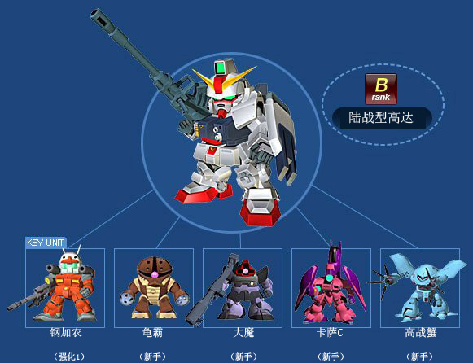

------------

## 高达

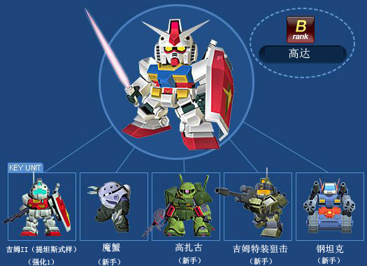

------------

## 高达Ez8

------------

## 麦塔斯

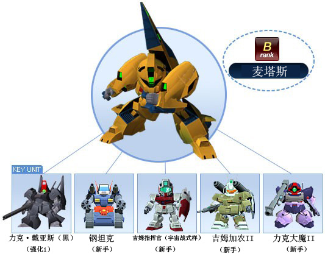

------------

## 龙飞

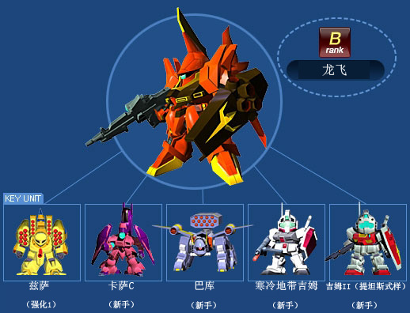

------------
