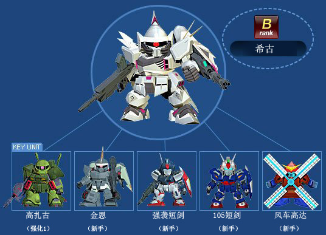
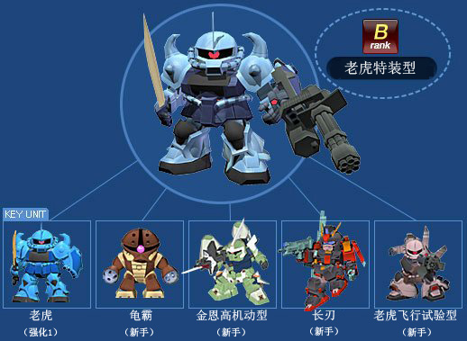
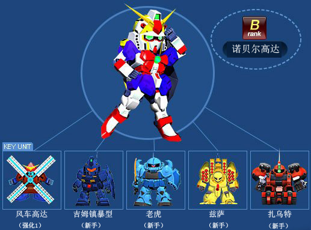

# B机体合成图

## 0高达

------------

## BD2

------------

## E魔蟹

------------

## GN-X（达利尔·达奇专用机）

.jpg ":size=500x")

------------

## GP-01玉兰

------------

## MKII（幽谷式样）

------------

## R-贾贾

------------

## 京宝樊

------------

## 伊芙利特改

------------

## 勇士

------------

## 希古

------------

## 异端金色机天（未完成）

------------

## 扎古2指挥官专用

------------

## 扎古III

------------

## 杜鲁基斯

------------

## 改良型勇士

------------

## 日升高达

------------

## Flag（格拉汉姆专用）

------------

## 梅萨拉

------------

## 汉姆扎比

------------

## 沙漠高达

------------

## 玻利诺克·萨曼

------------

## 勇士（海军陆战队专用）

------------

## 火虎

------------

## 炮击型勇士

------------

## 狙击型勇士

------------

## 盖茨

------------

## 盖茨（指挥官专用）

------------

## 神龙高达

------------

## 红异端

------------

## 老虎特装型

------------

## 绿异端

------------

## 红色角马

------------

## 苍蓝宿命1号机

------------

## 萨梅尔

------------

## 葛士尼

------------

## 蓝异端

------------

## 诺贝尔高达

------------

## 达基伊利斯

------------

## 迪杰

------------

## 里歇尔

------------

## 量产形卡碧尼

------------

## 金异端

------------

## 铁人（高机动形）

------------

## 阿历克斯

------------

## 陆战型高达

------------

## 高达

------------

## 高达Ez8

------------

## 麦塔斯

------------

## 龙飞

------------
