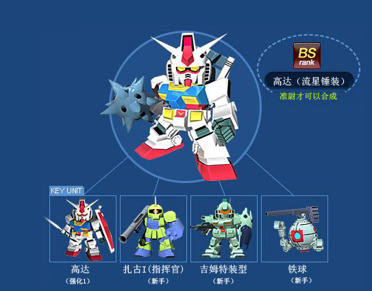

# BS机体合成图

## EZ8（剧场版样式）

------------

## GN-X （2000次男专用机）

------------

## GP-02A

------------

## 乍得·多加

------------

## 希古（克洛泽专用）

------------

## 利·卡兹（BWS）

------------

## 扎古II（多鲁兹专用）

------------

## 希古光束实验型

------------

## 异端金色机·天

------------

## 拉寇

------------

## 日升高达（修理装备）

------------

## 诺贝尔高达（超级模式）

------------

## 金恩（米盖尔专用）

------------

## 红异端出力增强型

------------

## 老虎特装型（诺里斯专用机）

------------

## 蓝异端（阳电子破城炮装）

------------

## 蓝异端2型L

------------

## 迪杰SE-R

------------

## 量产型卡碧尼（等粒子加农炮装）

------------

## 铁人桃子（超兵专用机）

------------

## 阿普萨拉斯I

------------

## 高达（流星锤装）

------------
